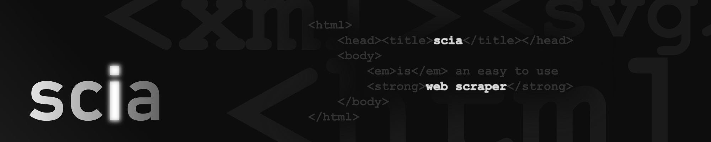

<p>
  
</p>

# Scia

Scia is an easy to use web scraper, that generates a structured JSON of your choice from any HTML. Works with Node.js, Deno and Bun.

## Getting started 

### Node.js

```sh
npm install scia
```

```js
import { scrape, select } from 'scia';

const json = await scrape('https://example.com',  { title: select('h1') });
```

### Deno

```js
import { scrape, select } from 'https://deno.land/x/scia/mod.ts';

const json = await scrape('https://example.com',  { title: select('h1') });
```

### Bun

```sh
bun install scia
```

```js
import { scrape, select } from 'scia';

const json = await scrape('https://example.com',  { title: select('h1') });
```